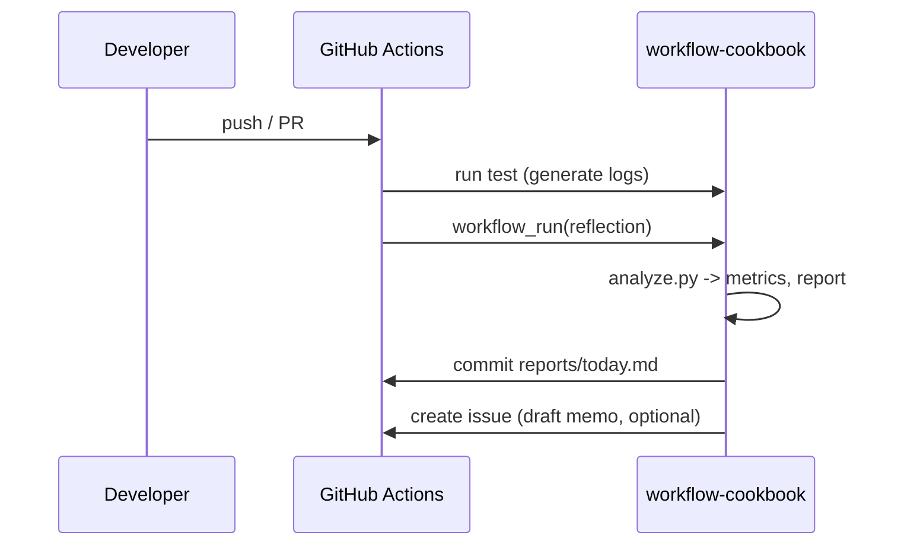

# 設計（Architecture）

## コンポーネント
- **Collector**: CI テストやツールから JSONL ログを収集（[ADR 0001](../../adr/0001-collector-analyzer-reporter-pipeline.md), [ADR 0002](../../adr/0002-jsonl-event-contract.md)）
- **Analyzer**: `workflow-cookbook/scripts/analyze.py` がメトリクス算出と Why-Why 草案生成（[ADR 0001](../../adr/0001-collector-analyzer-reporter-pipeline.md)）
- **Reporter**: `reports/today.md` と `reports/issue_suggestions.md` を生成（[ADR 0001](../../adr/0001-collector-analyzer-reporter-pipeline.md), [ADR 0003](../../adr/0003-propose-only-governance.md)）
- **Proposer**: Issue/ドラフトPR を“提案のみ”で作成（自動改変なし）（[ADR 0003](../../adr/0003-propose-only-governance.md)）
- **Governance**: `governance/policy.yaml` に行動制約・SLO（[ADR 0003](../../adr/0003-propose-only-governance.md)）

## データモデル（概略）
- TestRecord: `{ name, status, duration_ms, ts? }`
- Metrics: `{ pass_rate, duration_p95, flaky_rate? }`
- Report: Markdown（メトリクスと Why-Why）

## シーケンス（Mermaid）

## ASCII フォールバック
- Mermaid が利用できないレビュー環境では [docs/Architecture_ASCII.md](../../Architecture_ASCII.md) を参照し、Collector→Analyzer→Reporter→Proposer→Governance の責務と戻りフローを確認する。
- UI 骨子や CLI/レポートの画面構成をオフラインで確認する際は [Appendix B: UI モック](../../addenda/B_UI_Mock.md) を併用し、Analyzer/Reporter の入出力イメージを擦り合わせる。
- ドキュメント索引の手順は `docs/README.md` → `docs/ROADMAP_AND_SPECS.md` → 本ページ → `docs/adr/README.md` の順に辿り、Birdseye (`docs/birdseye/index.json`) のノード差分があれば同じコミットで更新する。

## サブディレクトリ対応方針
- `defaults.run.working-directory: workflow-cookbook`
- アーティファクトのパスは `workflow-cookbook/logs` に統一
