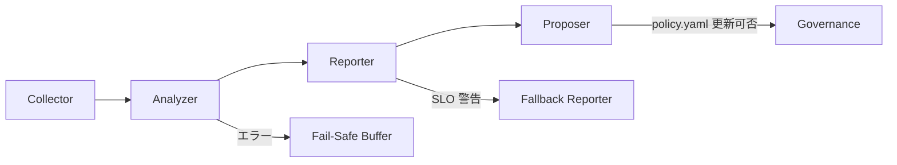

# Blueprint

## 1. 目的 / Purpose

Day8 の Collector→Analyzer→Reporter→Proposer パイプラインを運用する全ロールが同じ前提で意思決定できるように基準線を定義する。

- Day8 の観測要件とガバナンス制約を統合し、Collector→Analyzer→Reporter→Proposer パイプラインの基準線を共有する。
- Guardrails・RUNBOOK・EVALUATION へ展開する前に、課題背景・制約・成功指標を明文化し、差分検出時の参照点とする。
- Birdseye・ROADMAP_AND_SPECS の索引更新時に参照し、運用と設計の同期を保つ。

## 2. 担当ロール / Responsible Roles

| ロール | 担当 | 主責務 | エスカレーション | 指標 |
| --- | --- | --- | --- | --- |
| Collector Operator | Ops SRE チーム | ログ収集・JSONL 正常性の監視 | Analyzer Maintainer へ 5 分以内に転送 | 収集成功率 99.7%/日 |
| Analyzer Maintainer | Data Engineering | スキーマ検証・特徴抽出の更新 | Reporter Steward と SRE リード | スキーマ逸脱率 ≤0.5% |
| Reporter Steward | Product QA | 集計結果のレビューと配信承認 | Proposer Gatekeeper | レポート SLA 15 分内達成率 ≥99% |
| Proposer Gatekeeper | Governance & PM | 提案生成と policy.yaml 連携 | Guardrails オーナー | 提案承認から適用まで 1 営業日内 95% |
| Guardrails オーナー | Architecture WG | 制約・例外管理 | Steering 会合 | Blueprint 適用率 100% |

## 3. スコープ In-Out / Scope In-Out

- **In:** Day8 ログとイベントの収集、Analyzer の変換ロジック、Reporter 出力、Proposer の propose-only 運用、Birdseye・ROADMAP_AND_SPECS とのトレーサビリティ。
- **Out:** 実装コード詳細（`scripts/`・`tools/` の具体コマンド）、Day8 自動化パイプラインの範囲外にある運用環境、個別チームのリソース配分。

## 4. システム像 / System Image

- Collector は 60 秒毎に JSONL ログをバッチ取り込みし、Analyzer へ Webhook 送信する。
- Analyzer は JSON Schema v2025-09 と `docs/adr/0002-jsonl-event-contract.md` の仕様で検証し、Reporter 用メトリクスへ変換する。
- Reporter は `workflow-cookbook/logs/` 内の日次レポートを生成し、Proposer へ承認待ちキューを渡す。
- Proposer は `governance/policy.yaml` へ提案差分を生成し、Guardrails の許容内で propose-only を維持する。

### SLO

| 指標 | 目標値 | 監視方法 |
| --- | --- | --- |
| End-to-End レイテンシ (Collector 受信→Proposer 差分生成) | 99 パーセンタイルで ≤ 15 分 | `docs/addenda/M1_Metrics_Healthz_ADR.md` の Collector→Proposer 指標 |
| Collector 成功率 | 99.7% / 日 | `docs/day8/ops/04_ops.md` の監視ダッシュボード手順 |
| Analyzer スキーマ適合率 | ≥ 99.5% | `docs/adr/0002-jsonl-event-contract.md` に準拠した JSON Schema チェック |
| Reporter 配信 SLA | 15 分以内配信率 ≥ 99% | `docs/day8/quality/06_quality.md` の QA ゲート |
| Proposer 提案適用合意率 | 95% を 1 営業日以内 | `governance/policy.yaml` の承認ログ |

## 5. I/O 契約 / I/O Contract

| フェーズ | Input | Output | バリデーション |
| --- | --- | --- | --- |
| Collector | Day8 監視イベント (JSONL) | 正規化 JSONL (`workflow-cookbook/logs/incoming/*.jsonl`) | `docs/adr/0002-jsonl-event-contract.md` |
| Analyzer | 正規化 JSONL | 解析済み JSONL (`workflow-cookbook/logs/analyzed/*.jsonl`) と特徴量 CSV | CI JSON Schema Validator (`workflow-cookbook/scripts/run_ci_tests.py`) |
| Reporter | 解析済み JSONL/CSV | 日次レポート Markdown (`workflow-cookbook/reports/*.md`) | `docs/day8/quality/06_quality.md` の QA チェックリスト |
| Proposer | 日次レポート・差分提案 | `governance/policy.yaml` への Pull Request 提案 | `workflow-cookbook/TASK.codex.md` の propose-only ガイド |

## 6. ガードレール / Guardrails

- フェイルセーフ条件:
  - 5 分間で Collector 成功率が 95% 未満に落ちた場合は Collector をリードオンリーに切り替え、Analyzer へ `hold` シグナルを送る。
  - Analyzer スキーマ逸脱が 1% を超えた際は Reporter を停止し、`workflow-cookbook/logs/incident/*` へ自動記録、Proposer には `SAFE_MODE` 提案のみ許可。
  - Reporter 配信 SLA が 2 回連続で 15 分を超えた場合は Fallback Reporter を起動し、Proposer への新規提案を凍結する。
- Guardrails 遵守手順:
  - 例外は [SECURITY.md](SECURITY.md) と [SAFETY.md](SAFETY.md) の承認フローで 24 時間以内に記録。
  - policy.yaml の propose-only 原則は ADR-0003 を参照し、Proposer 以外からの変更は禁止。

## 7. 更新手順 / Update Procedure

1. Guardrails/HUB 差分を収集し、Collector→Proposer の SLO 影響を定量化する。
2. 本 Blueprint を更新し、Birdseye `index.json`・`caps/workflow-cookbook.BLUEPRINT.md.json` の `summary`・`maintenance` を同期する。
3. RUNBOOK・EVALUATION・CHECKLISTS を更新し、QA ゲートへ新しい SLO/フェイルセーフを反映する。
4. 更新内容を ROADMAP_AND_SPECS へ反映し、リンク導線を確認する。
5. 変更後 1 スプリント内にレビュー会で確認し、`CHANGELOG.md` と `workflow-cookbook/CHANGELOG.md` へ記載する。

## 8. 受入基準 / Acceptance Criteria

- SLO・フェイルセーフが Day8 テレメトリで監視可能かつ `docs/addenda/M1_Metrics_Healthz_ADR.md` / `docs/day8/quality/06_quality.md` の手順で検証されている。
- Guardrails 例外ログと policy.yaml 提案履歴が 1 営業日以内に追跡可能である。
- Birdseye と ROADMAP_AND_SPECS のリンクが最新セクションへ導く。
- 変更内容が RUNBOOK・CHECKLISTS・EVALUATION で再現可能とレビュー承認を得ている。
